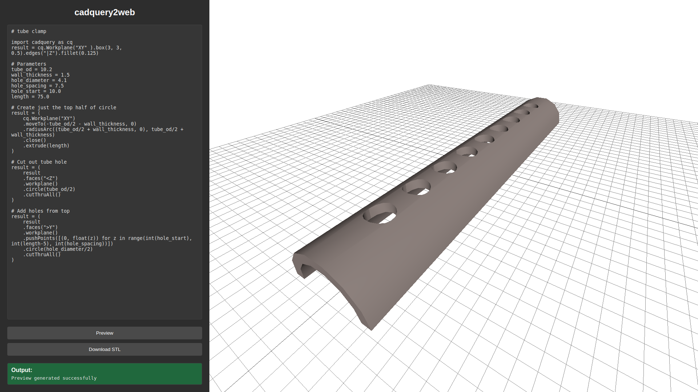

# cadquery2web

You know when you want to generate a [CadQuery](https://github.com/CadQuery/cadquery) STL file and print it at work, but you can't import CadQuery on your work laptop? Run it on your server at home and have a web based interface to view the model, and download the STL.

See a live instance at [cad.30hours.dev](http://cad.30hours.dev).



## Usage

- Run the containers using `docker-compose`:

  ```
  sudo docker compose up -d
  ```

- Navigate to [localhost:49157](http://localhost:49157) to start creating.

## Operation

The software consists of 3 containers:

- **web** runs the front-end. This is HTML/CSS/JavaScript that allows CadQuery code to be input, shows the current 3D model (coarse) with [three.js](https://github.com/mrdoob/three.js/) and allows requesting an STL/STEP to be generated from the server and downloaded. 

- **node** runs a Node.js server to handle requests from the user (geometry and STL/STEP requests) and serve these back to the client. It implements a queue to process requests for simultaneous users.

- **cadquery** runs the CadQuery server in Python. The CadQuery server has security controls to ensure only CadQuery code can be executed, to prevent remote code execution and privilege escalation (see the [CadQuery Dockerfile](./cadquery/Dockerfile) and [docker-compose.yml](./docker-compose.yml) for details). Strict whitelisting on the imports and functions that can be executed has been implemented in [CadQueryValidator.py](./cadquery/CadQueryValidator.py).

  Once code passes the validator, the shape undergoes coarse tesselation into vertices and faces. This data is passed back to the web front-end for display. An STL/STEP file can then be generated for the high resolution model.

## Notes

- See [CadQuery examples](https://cadquery.readthedocs.io/en/latest/examples.html) for code that can be run directly.
- Loosely based on [replicad](https://github.com/sgenoud/replicad) but using CadQuery instead of [OpenCascade.js](https://ocjs.org/).
- Pull requests are very welcome.

## Future Work

- Support arbitrary function definitions. At the moment all functions are whitelisted, so while they can be defined, they cannot be executed. Will need to examine how this may compromise server security.
- Add line numbers to Python editor.
- Better error reporting/handling for syntax issues.
- Add axis labels on three.js display.

## License

[MIT](https://choosealicense.com/licenses/mit/)
